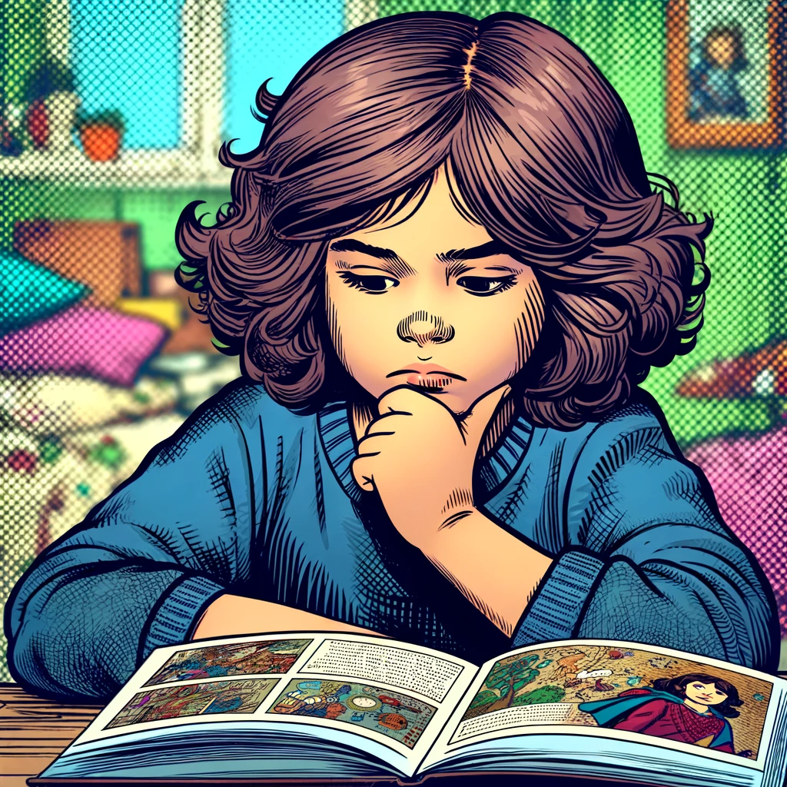
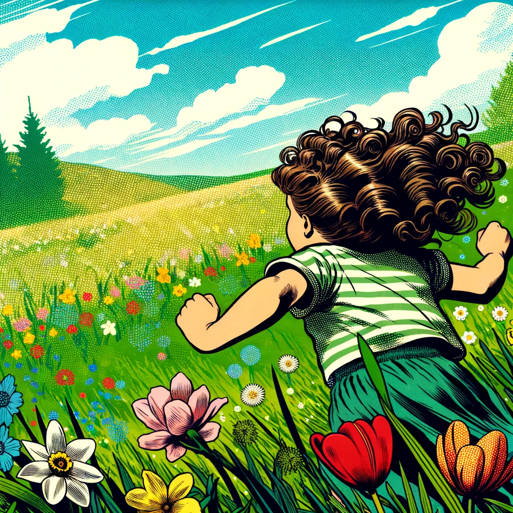
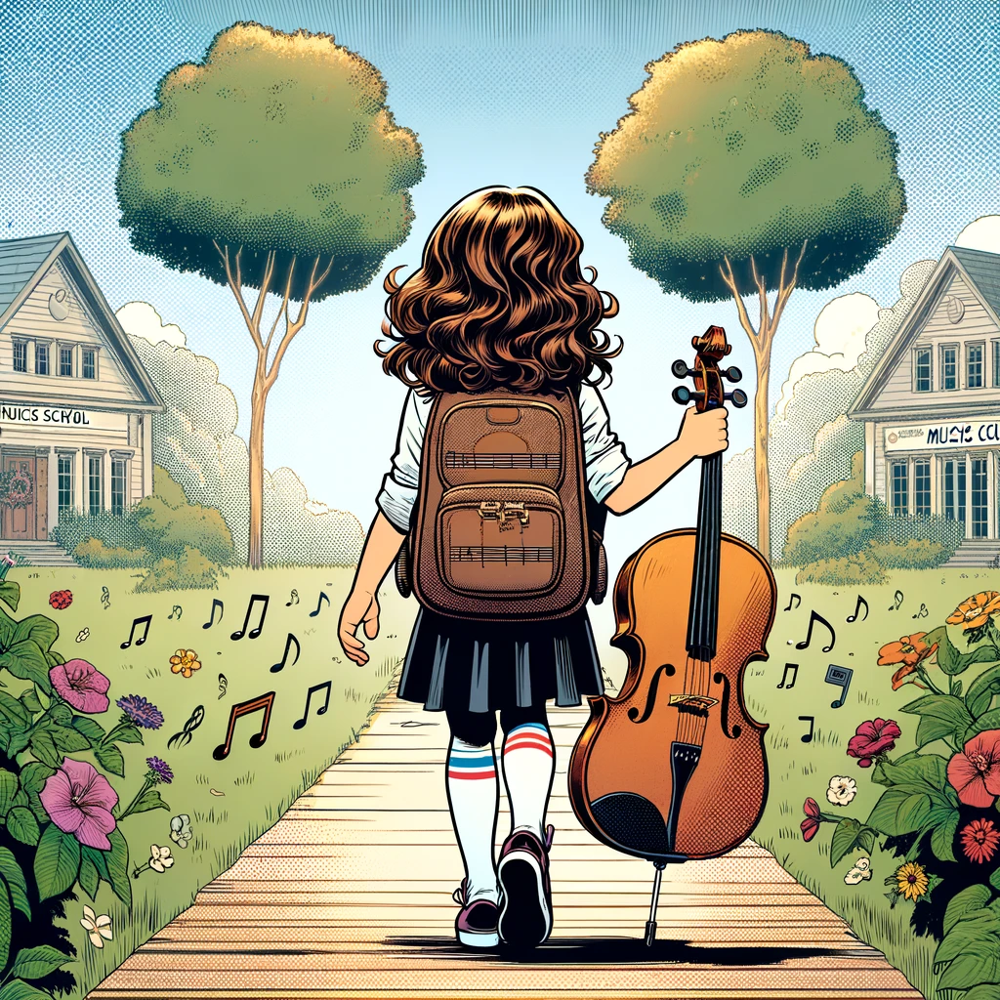
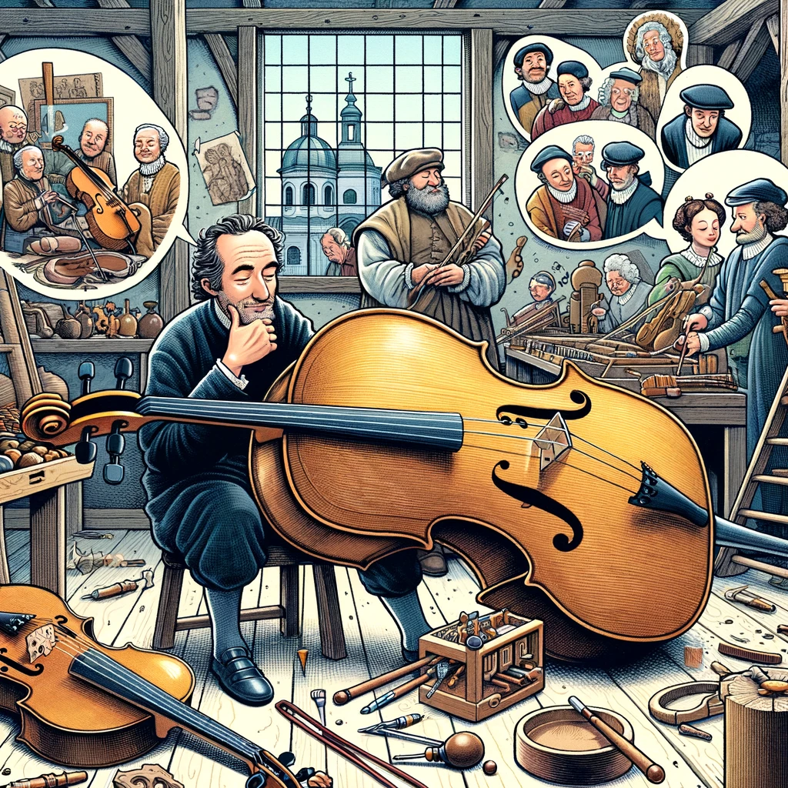
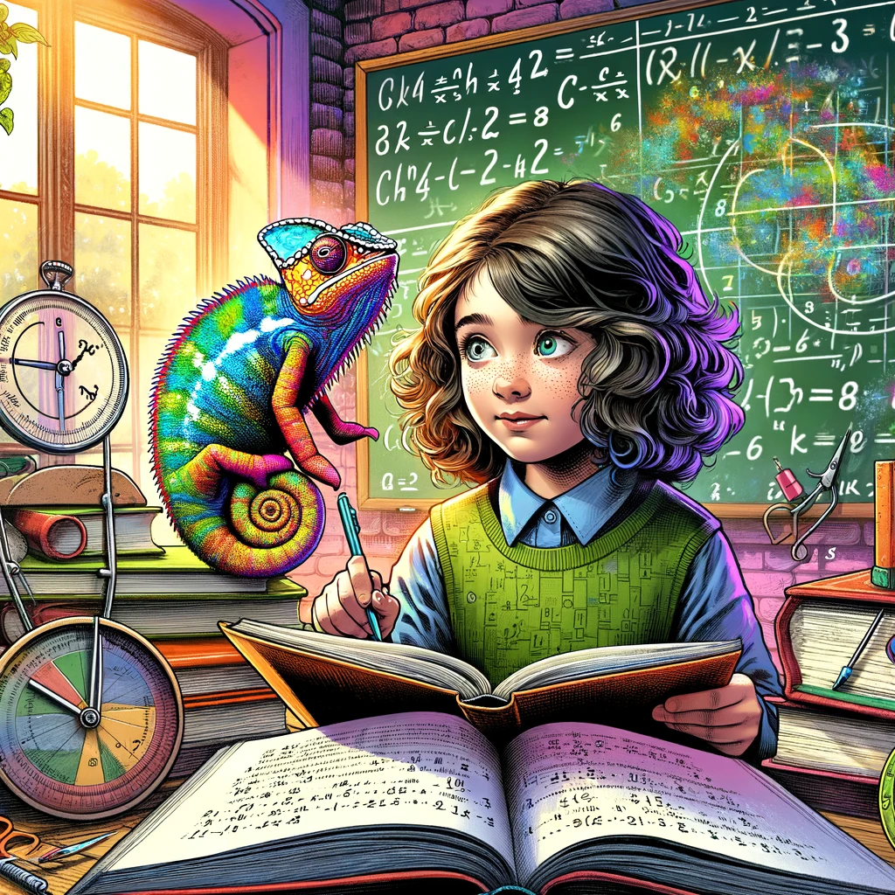
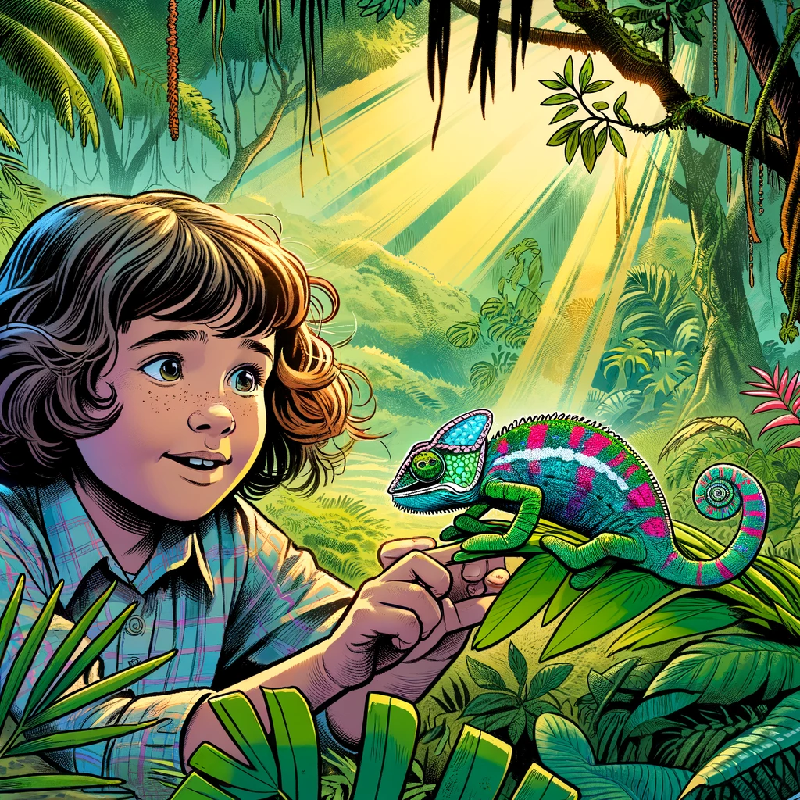
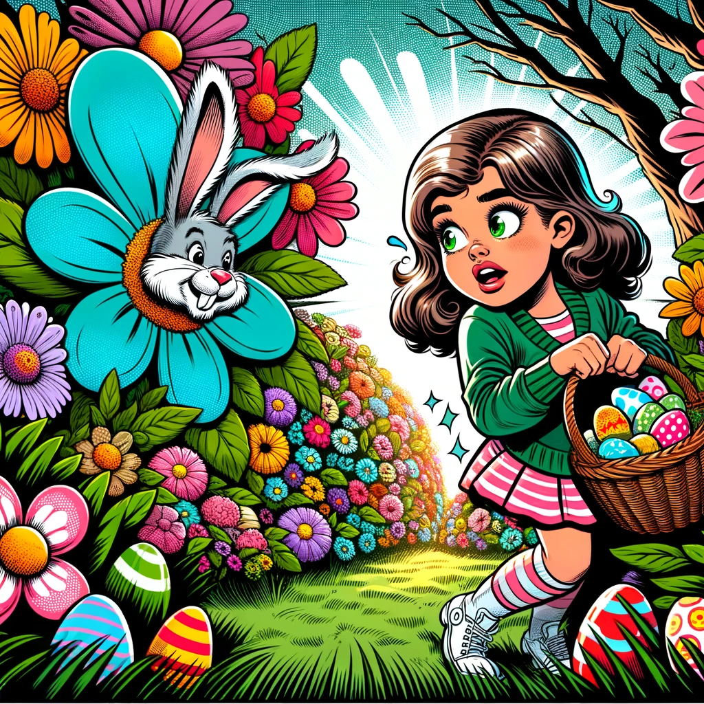

<!--
author:   Andre Dietrich

version:  2.0.0

language: de

narrator: Deutsch Male

comment:  Kleine Lernaufgaben-Sammlung für meine Emilia.


-->

# Für Emilia

    --{{0}}--
Hallo Emilia, meine kleine Maus.
Hier sind ein paar kleine Rätzelaufgaben und Übungen für dich.
Ich hoffe, dass sie dir gefallen und du dabei auch noch etwas lernst.
Ich werde versuchen mir jeden Tag etwas neues auszudenken.



## März

    --{{0}}--
Der März ist der dritte Monat des Jahres im gregorianischen Kalender und hat 31 Tage.
Er ist nach dem römischen Kriegsgott Mars benannt.
Im März beginnt der Frühling und wir werden Ostern feiern und du wirst Osterferien haben.
Zu Ostern gibt es auch eine ganz tolle Überraschung für dich.



### Mittwoch - 20.03.2024

    --{{0}}--
Heute ist also der allererste Tag.
Weil ich weiß, dass du bald zum ersten Mal in der Musikschule auf dem Cello spielen wirst, werden wir zunächst ein wenig über das Cello lernen.




#### Das Cello

Es war einmal ein besonderes Musikinstrument namens Cello, das vor langer Zeit, ungefähr im 16. Jahrhundert, erfunden wurde. Das Cello sieht aus wie eine riesige Geige und hat tiefe, wunderschöne Töne, die oft an die menschliche Stimme erinnern.

Die Erfinder des Cellos waren sehr kluge Menschen aus Italien, die beschlossen, ein Instrument zu schaffen, das tiefer und voller klingt als die Geige, aber immer noch schöne Melodien spielen kann. So entstand das Cello, das manchmal auch Violoncello genannt wird, was auf Italienisch "kleine Viola" bedeutet.



Das Cello hat vier Saiten, und um darauf zu spielen, muss man einen Bogen über die Saiten ziehen. Wenn der Bogen die Saiten berührt, fangen sie an zu schwingen und erzeugen Musik. Cellisten, also die Menschen, die das Cello spielen, sitzen beim Spielen und halten das Cello zwischen ihren Beinen.

Im Laufe der Jahre wurde das Cello in vielen verschiedenen Arten von Musik eingesetzt. Von klassischer Musik, wo es oft in Orchestern zu hören ist, bis hin zu moderner Musik in Bands und sogar alleine als Soloinstrument. Das Cello kann fröhliche Lieder spielen, aber auch traurige Melodien, die manchmal die Menschen zum Weinen bringen.

Ein berühmter Cellospieler war Pablo Casals. Er spielte das Cello so schön, dass Menschen aus der ganzen Welt ihm zuhören wollten. Heute gibt es viele Cellisten, die wunderbare Musik machen und zeigen, wie vielseitig das Cello ist.

Das Cello ist also ein ganz besonderes Musikinstrument, das schon seit vielen Jahren existiert und Menschen mit seiner Musik berührt. Es erzählt Geschichten ohne Worte und kann uns glücklich machen oder trösten, wenn wir traurig sind.


----

    {{|>}}
Hast du den ganzen Text gelesen? Dann kannst du mir jetzt ein paar Fragen beantworten:

> __Wieviele Saiten hat ein Cello?__
>
> - [( )] 3
> - [(X)] 4
> - [( )] 5
> - [( )] mehr als 5


> __Was bedeutet das Wort "Violoncello"?__
>
> - [( )] große Viola
> - [(X)] kleine Viola
> - [( )] große Bratsche
> - [( )] kleine Bratsche


#### Knifflige Mathe-Rätzel


    --{{0}}--
Bevor wir uns an das erste Rätzel machen, möchte ich dir noch ein paar kleine Übungen zeigen, die dir helfen sollen ein Ass im Kopfrechnen zu werden.
Rechne zuerst dein Ergebnis selber aus und vergleiche dann mit dem Linieal.
Als ich in deinem Alter war, habe ich alles mit dem Lineal gerechnet und nicht mit den Fingern.
Wenn du bereit bist, klicke auf weiter.


``` ascii
.-------------------------------------------------------------------------------------------------------------------------------------------------------------.
|                                                                                                                                                             |
|  +---+---+---+---+---+---+---+---+---+---+---+---+---+---+---+---+---+---+---+---+---+---+---+---+---+---+---+---+---+---+---+---+---+---+---+---+---+---+  |
|  |   |   |   |   |   |   |   |   |   |   |   |   |   |   |   |   |   |   |   |   |   |   |   |   |   |   |   |   |   |   |   |   |   |   |   |   |   |   |  |
|  |       |       |       |       |       |       |       |       |       |       |       |       |       |       |       |       |       |       |       |  |
|                                                                                                                                                             |
|  0       1       2       3       5       6       7       8       9      10      11      12      13      14      15      16      17      18      19      20  |
|                                                                                                                                                             |
'-------------------------------------------------------------------------------------------------------------------------------------------------------------'
```

    {{1-2}}
<section style="margin-left: 2cm">

---

12 + 8 = [[ 20 ]]

</section>


    {{2-3}}
<section style="margin-left: 2cm">

----

8 + 9 = [[ 17 ]]

</section>


    {{3-4}}
<section style="margin-left: 2cm">

---

3 + [[ 5 ]] = 8

</section>


    {{4-5}}
<section style="margin-left: 2cm">

---

[[ 5 ]] + 7 = 12

</section>


    {{5-6}}
<section style="margin-left: 2cm">

---

[[ 5 ]] + 13 = 18 

</section>


    {{6-7}}
<section style="margin-left: 2cm">

---

18 - 7 = [[ 11 ]] 

</section>


    {{7-8}}
<section style="margin-left: 2cm">

---

20 - 13 = [[ 7 ]] 

</section>


    {{8-9}}
<section style="margin-left: 2cm">

---

14 - 3 = [[ 11 ]] 

</section>


    {{9-10}}
<section style="margin-left: 2cm">

---

18 - 7 = [[ 11 ]] 

</section>

    {{10-11}}
<section style="margin-left: 2cm">

---

14 - 7 + 5 = [[ 12 ]] 

</section>


      --{{11}}--
Das hast du super gemacht. Versuche die folgende Zahlenpyramide zu lösen.
Der Stein, der oben auf zwei anderen Steinen liegt, ist immer das zusammengerechnete Ergebnis der beiden darunterliegenden.
Kannst du dieses schwere Rätzel lösen?

      {{11}}
<!-- data-show-partial-solution style="font-size: 1.75rem"-->
``` ascii
                        .----------------------.
                       /                      /|
             .--------+----------------------+ +---------.
            /         |     "[[  20   ]]  "  |/         /|
  .--------+----------+----------+-----------+---------+ +----------.
 /         |         11          |      "[[   9    ]] "|/          /|
+----------+----------+----------+----------+----------+----------+ +
|      " [[   5   ]] "|          6          |          3          |/
+---------------------+---------------------+---------------------+
```

### Donnerstag - 21.03.2024

    --{{0}}--
Hallo meine kleine Maus, heute ist ein neuer Tag und ich habe wieder ein paar kleine Aufgaben für dich.
Zwei Sachen hatte ich dir ja versprochen, einmal eine Geschichte über ein Chamäleon und ein paar schwierigere Matheaufgaben, wobei du unendlich viele davon machen kannst.



#### Das Chamäleon
<!--
narrator: French Male
-->



Es war einmal ein kleines Mädchen namens Emi, das während eines Spaziergangs mit ihrer Familie tief in den Urwald wanderte. Emi liebte es, die bunten Blumen und die hohen Bäume zu betrachten. Aber was sie am meisten liebte, waren die Tiere, die im Urwald lebten.
Plötzlich entdeckte Emi etwas Ungewöhnliches auf einem Blatt. Es war ein Chamäleon, das sich perfekt an seine Umgebung angepasst hatte. Emi war überrascht, als das Chamäleon zu sprechen begann.

>    {{|>}}
> _Hallo, ich bin Charlie, das Chamäleon._

Emi, neugierig und erstaunt zugleich, setzte sich neben Charlie. "Wie machst du das mit deinen Farben?" fragte sie.

>    {{|>}}
> _Das ist ein besonderes Geheimnis der Chamäleons. Unsere Haut hat eine spezielle Schicht, die sich dehnen und zusammenziehen kann. Dadurch ändert sich die Farbe unserer Haut. Es hilft uns, uns zu verstecken und vor Raubtieren sicher zu sein._

"Wow, das ist ja interessant!" sagte Emi. "Änderst du deine Farbe nur, um dich zu verstecken?"

>    {{|>}}
> _Nicht nur. Wir Chamäleons ändern unsere Farben auch, um zu zeigen, wie wir uns fühlen. Wenn wir glücklich oder aufgeregt sind, können wir heller werden. Und wenn wir uns bedroht fühlen, nehmen wir dunklere Farben an._

Emi war fasziniert. "Das ist ja wie Magie!" Charlie lachte.

>    {{|>}}
> _Ja, man könnte es Magie nennen. Aber es ist auch wichtig zu wissen, dass wir Chamäleons langsame Tiere sind und gerne Zeit in den Bäumen verbringen. Wir fangen Insekten mit unserer langen, klebrigen Zunge._

Emi nickte, beeindruckt von allem, was sie gelernt hatte. "Danke, Charlie, dass du mir so viel über Chamäleons beigebracht hast. Ich werde nie vergessen, wie besonders ihr seid."

>    {{|>}}
> _Es war mir eine Freude, Emi. Komm jederzeit wieder vorbei._

Das werde ich, sagte Emi, bevor Charlie mit einem Zwinkern begann langsam seine Farbe änderte, um sich mit dem grünen Blatt zu verschmelzen.
Emi winkte zum Abschied und lief zurück zu ihrer Familie, bereit, ihnen alles zu erzählen, was sie über das faszinierende Chamäleon gelernt hatte.


#### Unendliche Matheaufgaben

    --{{0}}--
Wie versprochen hier die Unendlichen Aufgaben.
Wenn du oben auf "Neue Aufgabe" klickst, dann wird darunter immer wieder eine neue Aufgabe erstellt.
Ich bin gespannt, wie viele du lösen kannst.

<script input="submit" output="Aufgabe" default="Neue Aufgabe" modify="false" style="font-size: 40px; margin-bottom: 90px;">
if (!window.randomMath) {
    window.randomMath = 0
}

"Neue Aufgabe " + window.randomMath++
</script>

<script run-once modify="false" style="font-size: 40px;">
// @input(`Aufgabe`)
function generate() {
    // Zufällige Operation auswählen (0 für Addition, 1 für Subtraktion)
    const operation = Math.floor(Math.random() * 2);
    // Zufällige Zahlen für a und b generieren
    const a = Math.floor(Math.random() * 21); // Zahlen zwischen 0 und 20
    const b = Math.floor(Math.random() * 21); // Zahlen zwischen 0 und 20
    // Berechnung des Ergebnisses c
    const c = operation === 0 ? a + b : a - b;
    // Auswahl einer Zufälligen Zahl für die Markierung

    if (c < 0 || c > 20) {
        return generate();
    }


    const markedNumber = Math.floor(Math.random() * 3);
    let problem = '';

    // Aufbau der Aufgabe basierend auf der Operation
    if (operation === 0) {
        problem = `${a} + ${b} = ${c}`;
    } else {
        problem = `${a} - ${b} = ${c}`;
    }

    // Markierung der ausgewählten Zahl
    if (markedNumber === 0) {
        problem = problem.replace(a.toString(), `[[ ${a} ]]`);
    } else if (markedNumber === 1) {
        problem = problem.replace(b.toString(), `[[ ${b} ]]`);
    } else {
        problem = problem.replace(c.toString(), `[[ ${c} ]]`);
    }


    return "LIASCRIPT:  <!-- data-solution-button='off' -->\n:-) -->  " + problem;
}

generate();
</script>

### Ostern

Hallo Emilia, es hat etwas gedauert, aber ich habe die unendlichen Matheaufgaben endlich endlich repariert.
Wenn du willst, dann kannst du vorher noch die Ostergeschichte lesen und dann so viele Aufgaben lösen, wie du möchtest.



#### Emilia trifft den Osterhasen

Ein kleines Mädchen namens Emila besuchte einst ihre Großseltern. Jedes Jahr freute sich Emilia riesig auf Ostern, besonders auf das Ostereiersuchen. Eines schönen Ostermorgens, als Omas Garten in sanftes Sonnenlicht getaucht war, begann Emilia mit der Suche.

Während sie zwischen den Blumen und Büschen nach bunten Eiern suchte, bemerkte sie plötzlich etwas Weißes hinter einem Busch. Vorsichtig näherte sie sich und traute ihren Augen kaum: Vor ihr saß der Osterhase!

"Hallo, ich bin Olli, der Osterhase," sagte er mit einer sanften Stimme.

Emi konnte es nicht fassen. "Wirklich? Erzähl mir mehr über Ostern und die Osterhasen!"
Olli lächelte. "Gerne, Emilia. Weißt du, Ostern ist ein sehr altes Fest. Es feiert den Frühling und neues Leben. Und ich, als Osterhase, habe eine besondere Aufgabe. Ich bringe die Ostereier und verstecke sie für Kinder wie dich. Die Eier sind ein Symbol für neues Leben und Hoffnung."

Emilia hörte gespannt zu. "Aber warum gerade ein Hase?" fragte sie neugierig.
"Das ist eine gute Frage," antwortete Olli. "Hasen sind ein Symbol für Fruchtbarkeit und das Erwachen der Natur im Frühling. Schon vor langer Zeit glaubten die Menschen, dass Hasen Glück bringen. Und so wurde ich, der Osterhase, zum Boten des Frühlings und der Freude."

"Das ist ja interessant!" rief Emilia aus. "Und wie machst du all die bunten Eier?"

Olli zwinkerte. "Das ist ein kleines Geheimnis. Aber ich kann dir sagen, dass es viel Freude und ein bisschen Magie braucht, um die Eier so schön bunt zu machen. Jedes Ei ist ein Kunstwerk und wird mit Liebe gemacht."
Emilia lächelte breit. "Danke, Olli, dass du mir so viel über Ostern und die Osterhasen erzählt hast. Ich werde Ostern jetzt noch mehr lieben."

"Das freut mich zu hören, Lena. Und vergiss nicht, Ostern ist eine Zeit der Freude, des Teilens und des Zusammenseins mit der Familie," sagte Olli, bevor er leise hoppelte und im Garten verschwand.

Emilia fand an diesem Tag nicht nur bunte Ostereier, sondern auch eine wunderbare neue Geschichte, die sie ihrer Familie beim Osterfrühstück erzählte.